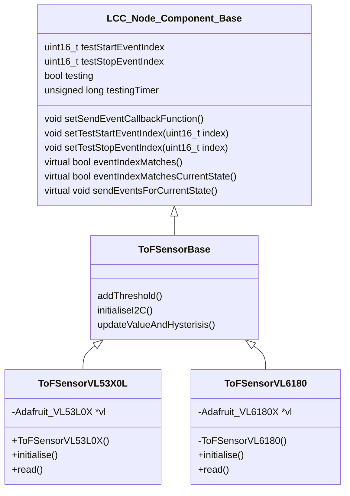

```mermaid
classDiagram
    LCC_Node_Component_Base <|-- ToFSensorBase
    ToFSensorBase <|-- ToFSensorVL53X0L
    ToFSensorBase <|-- ToFSensorVL6180

    class LCC_Node_Component_Base {
      uint16_t testStartEventIndex
      uint16_t testStopEventIndex
      bool testing
      unsigned long testingTimer

      void setSendEventCallbackFunction()
      void setTestStartEventIndex(uint16_t index)
      void setTestStopEventIndex(uint16_t index)

      virtual bool eventIndexMatches()
      virtual bool eventIndexMatchesCurrentState()
      virtual void sendEventsForCurrentState()

    }

    class ToFSensorBase {
      addThreshold()
      initialiseI2C()
      updateValueAndHysterisis()


    }

    class ToFSensorVL53X0L {
      -Adafruit_VL53L0X *vl
      +ToFSensorVL53L0X()
      +initialise()
      +read()
    }

    class ToFSensorVL6180 {
      -Adafruit_VL6180X *vl
      -ToFSensorVL6180()
      +initialise()
      +read()
    }
```
